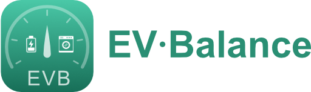

  

  <a href="README.md">English</a> · <a href="README.it.md">Italiano</a> · <a href="README.de.md">Deutsch</a> · <b>Français</b>

# EV Balance — Équilibreur de charge énergétique pour Home Assistant

Intégration personnalisée (installable via **HACS**) qui évite le déclenchement
du compteur par surcharge en modulant le courant de la borne de recharge selon
la consommation du foyer, et qui suit l'énergie par **plages horaires** (ARERA
italien F1/F2/F3) avec réinitialisation quotidienne et mensuelle.

## Fonctionnement

À chaque cycle (par défaut toutes les 3 s), l'intégration :

1. lit la **puissance instantanée** de la borne et des sources configurées ;
2. calcule le budget disponible :
   `budget = limite_compteur − marge_sécurité − consommation_sources` ;
3. convertit le budget en ampères (selon la tension et le nombre de phases) et
   l'écrit dans l'**entité number** de la borne ;
4. si la consommation hors borne dépasse la limite, elle met la borne **en pause**.

### Hystérésis (anti-oscillation)

- **Réduction / pause → immédiate** (sécurité).
- **Augmentation → autorisée seulement après `hold_seconds`** (par défaut 300 s
  = 5 min) depuis le dernier changement. La valeur n'est ainsi pas modifiée en
  permanence.

## Installation (HACS)

1. HACS → *Integrations* → menu ⋮ → **Custom repositories**.
2. Ajoutez l'URL de ce dépôt, catégorie **Integration**.
3. Installez **EV Balance** et redémarrez Home Assistant.
4. *Paramètres → Appareils et services → Ajouter une intégration → EV Balance*.

> Vous pouvez aussi copier le dossier `custom_components/evbalance/` dans votre
> dossier `config/custom_components/` puis redémarrer.

## Configuration

**Réglages initiaux (structurels, définis à la première configuration) :**

| Paramètre | Défaut | À quoi ça sert |
|---|---|---|
| Nom | EV Balance | Nom de l'instance d'intégration |
| Capteur de puissance borne | — | `sensor.*` (device_class power) en W/kW avec la puissance actuelle de la borne |
| Number courant borne | — | Entité `number.*` où l'équilibreur écrit le courant max en ampères |
| Sources de consommation | (aucune) | Capteurs de puissance du reste de la maison, soustraits du budget (sélection multiple) |
| La source inclut la borne | désactivé | ACTIVÉ si une source mesure déjà la borne, pour ne pas la compter deux fois |
| Limite maximale du compteur | 3300 W | Puissance au-delà de laquelle le compteur déclenche ; le plafond à ne pas dépasser |
| Tension | 230 V | Tension de ligne, sert à convertir watts ↔ ampères |
| Alimentation / Phases | Monophasé | Monophasé (1) ou triphasé (3), influe sur la conversion W↔A |
| Courant min | 6 A | En dessous, la borne est mise en pause plutôt que bridée |
| Courant max | 16 A | Courant le plus élevé pouvant être écrit sur la borne |

**Options (modifiables à chaud, sans redémarrage) :**

| Paramètre | Défaut | À quoi ça sert |
|---|---|---|
| Sources de consommation | (aucune) | Comme ci-dessus, modifiable ensuite |
| La source inclut la borne | désactivé | Comme ci-dessus, modifiable ensuite |
| Marge de sécurité | 200 W | Réserve laissée libre sous la limite compteur, absorbe les pics |
| Courant de pause | 0 A | Valeur écrite pour « arrêter » la charge en pause (certaines bornes exigent une valeur > 0) |
| Paliers de courant autorisés | (vide) | Liste d'ampères autorisés séparés par des virgules (ex. `6, 8, 10, 16`) ; vide = chaque entier de min à max |
| Hold seconds | 300 s | Attente minimale avant de pouvoir réaugmenter le courant (anti-oscillation) |
| Intervalle de mise à jour | 3 s | Fréquence de lecture et d'application du courant (minimum 3 s) |
| Preset tarifaire | ARERA F1/F2/F3 | Jeu de plages horaires pour le suivi d'énergie (ARERA ou plage unique) |
| Afficher le panneau | activé | Affiche/masque le panneau EV Balance dans la barre latérale |

## Entités créées

- **Switch** *Équilibrage actif* — sur OFF, il lit mais ne touche pas à la borne.
- **Binary sensor** *Charge en pause* — avec l'attribut `reasons` (explique la décision).
- **Number** *Limite maximale du compteur*, *Marge de sécurité* — réglage en direct.
- **Sensor** puissance totale/sources/borne, *Courant autorisé*, *Plage active*.
- **Sensor énergie** pour chaque source × plage × période (quotidien + mensuel),
  en kWh, `state_class: total_increasing` → compatible avec le tableau de bord Énergie.

## Panneau latéral

L'intégration enregistre un **panneau latéral optionnel** (custom element, sans
étape de build) affichant la puissance en direct, le courant autorisé, la limite
du compteur et l'énergie par plage des derniers mois. Il lit tout depuis les
entités existantes et les statistiques long terme du Recorder — aucun stockage
supplémentaire. Activable depuis les options (*Afficher le panneau*).

## Plages horaires ARERA

| Plage | Quand |
|---|---|
| **F1** | Lun–Ven 08:00–19:00 |
| **F2** | Lun–Ven 07:00–08:00 et 19:00–23:00 ; Sam 07:00–23:00 |
| **F3** | Lun–Ven 23:00–07:00 ; Sam 23:00–07:00 ; dimanches et jours fériés |

Les plages sont pilotées par les données
([`energy.py`](custom_components/evbalance/energy.py)) : ajouter un preset
personnalisé revient à ajouter des règles, sans toucher à la logique.

## Développement

La logique d'équilibrage est isolée et testable dans
[`balancer.py`](custom_components/evbalance/balancer.py) (aucune dépendance à
Home Assistant).

## ⚠️ Sécurité

Ce logiciel module le courant mais **ne remplace pas les protections
électriques** de l'installation. Définissez toujours une marge de sécurité
adéquate et vérifiez le comportement de votre borne lorsqu'elle reçoit 0 A.

### ⚠️ Avertissement

L'utilisation de l'application et le réglage de ses paramètres **devraient être
effectués exclusivement par des personnes autorisées et expertes**. L'auteur
décline toute responsabilité pour d'éventuels dommages aux biens et aux
personnes, directement ou indirectement, découlant de l'usage de ce logiciel.

## Licence

Source-available sous la **PolyForm Noncommercial License 1.0.0** avec des
conditions supplémentaires — voir [`LICENSE`](LICENSE).

En bref :

- **Gratuit** pour tout usage non commercial / non professionnel.
- Les copies et œuvres dérivées ne peuvent être redistribuées **qu'au sein d'un
  projet open source** (licence approuvée par l'OSI, source publique complète).
- Tous les droits restent la propriété exclusive de Matteo Dalle Feste, qui peut
  changer la licence des versions futures ou fermer le logiciel à tout moment.
- **L'usage commercial ou professionnel nécessite un accord écrit distinct** —
  contact : matteo@dallefeste.com.
