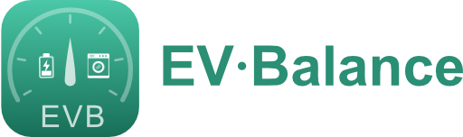

  

  <a href="README.md">English</a> · <b>Italiano</b> · <a href="README.de.md">Deutsch</a> · <a href="README.fr.md">Français</a>

# EV Balance — Load balancer energetico per Home Assistant

Integrazione custom (installabile via **HACS**) che evita il distacco del
contatore per sovraccarico modulando la corrente della EV Charger in base ai
consumi di casa, e che tiene traccia dell'energia per **fasce orarie** (ARERA
F1/F2/F3) con reset giornaliero e mensile.

## Come funziona

Ad ogni ciclo (default ogni 3 s) l'integrazione:

1. legge la **potenza istantanea** della EV Charger e delle sorgenti configurate;
2. calcola il budget disponibile:
   `budget = limite_contatore − margine_sicurezza − consumi_sorgenti`;
3. converte il budget in Ampere (in base a tensione e n° fasi) e lo scrive
   sulla **number entity** della EV Charger;
4. se i consumi non-EV Charger superano il limite, mette la EV Charger **in pausa**.

### Isteresi (anti-flapping)

- **Riduzione / pausa → immediata** (sicurezza).
- **Aumento → consentito solo dopo `hold_seconds`** (default 300 s = 5 min)
  dall'ultima variazione. Così il valore non viene modificato di continuo.

## Installazione (HACS)

1. HACS → *Integrations* → menu ⋮ → **Custom repositories**.
2. Aggiungi l'URL di questo repository, categoria **Integration**.
3. Installa **EV Balance** e riavvia Home Assistant.
4. *Impostazioni → Dispositivi e servizi → Aggiungi integrazione → EV Balance*.

> In alternativa, copia la cartella `custom_components/evbalance/` dentro la
> tua cartella `config/custom_components/` e riavvia.

## Configurazione

**Setup iniziale (strutturale, impostato alla prima configurazione):**

| Parametro | Default | A cosa serve |
|---|---|---|
| Nome | EV Balance | Nome dell'istanza dell'integrazione |
| Sensore potenza EV Charger | — | `sensor.*` (device_class power) in W/kW con la potenza attuale della EV Charger |
| Number corrente EV Charger | — | Entità `number.*` su cui il balancer scrive gli Ampere massimi |
| Sorgenti di consumo | (nessuna) | Sensori di potenza del resto della casa, sottratti dal budget (multi-select) |
| La sorgente include la EV Charger | off | ON se una sorgente misura già anche la EV Charger, così non viene contata due volte |
| Limite massimo contatore | 3300 W | Potenza oltre cui il contatore stacca; è il tetto sotto cui il balancer resta |
| Tensione | 230 V | Tensione di linea, usata per convertire Watt ↔ Ampere |
| Alimentazione / Fasi | Monofase | Monofase (1) o trifase (3), incide sulla conversione W↔A |
| Corrente min | 6 A | Sotto questo valore la EV Charger viene messa in pausa invece che ridotta |
| Corrente max | 16 A | Corrente più alta scrivibile sulla EV Charger |

**Opzioni (modificabili a caldo, senza riavvio):**

| Parametro | Default | A cosa serve |
|---|---|---|
| Sorgenti di consumo | (nessuna) | Come sopra, modificabile in seguito |
| La sorgente include la EV Charger | off | Come sopra, modificabile in seguito |
| Margine di sicurezza | 200 W | Riserva lasciata libera sotto il limite contatore, assorbe i picchi |
| Corrente di pausa | 0 A | Valore scritto per "fermare" la ricarica in pausa (alcune EV Charger richiedono un valore > 0) |
| Ricarica solo in queste fasce | (tutte) | Fasce in cui è consentito ricaricare; nessuna selezionata = tutte |
| Step di corrente ammessi | (vuoto) | Elenco di Ampere ammessi separati da virgola (es. `6, 8, 10, 16`); vuoto = ogni intero da min a max |
| Hold seconds | 300 s | Attesa minima prima di poter rialzare la corrente (anti-flapping) |
| Intervallo di aggiornamento | 3 s | Ogni quanto legge la potenza e applica la corrente (minimo 3 s) |
| Preset fasce | ARERA F1/F2/F3 | Set di fasce orarie per il conteggio energia (ARERA o fascia unica) |
| Mostra pannello | on | Mostra/nasconde il pannello EV Balance nella sidebar |

## Controllo OCPP (collegamento diretto alla wallbox)

Invece di pilotare la wallbox tramite entità di Home Assistant, EV Balance può
**parlarle direttamente in OCPP 1.6J**. La modalità si sceglie quando si
aggiunge l'integrazione: *Direttamente in OCPP 1.6*.

EV Balance avvia un piccolo **CSMS** (il sistema centrale OCPP): la wallbox si
collega a lui via websocket, senza integrazioni del produttore né servizi cloud.

**Perché conta.** Con il controllo per entità, mettere in pausa sotto il minimo
della wallbox è un problema: scrivere 0 A su un `number` che ha minimo 6 A non
ferma la ricarica, la wallbox continua a erogare il minimo sopra ai consumi di
casa e il contatore scatta. In OCPP la pausa è semplicemente un **charging
profile con limite 0 A**: la wallbox sospende l'erogazione (`SuspendedEVSE`)
tenendo aperta la sessione, e si riprende rialzando il limite — senza switch,
senza riautorizzazione, senza staccare il cavo.

**Come si configura**

1. Aggiungi l'integrazione e scegli *Direttamente in OCPP 1.6*.
2. Punta la wallbox su `ws://<indirizzo-home-assistant>:<porta>/<Charge Point ID>`
   (porta 9000 di default). Sulle wallbox Wallbox si imposta dall'app, in
   *Impostazioni → Gestione esterna → OCPP*.
3. Il Charge Point ID deve coincidere con quello configurato qui, **maiuscole
   comprese**. Lascia il campo vuoto per accettare la prima wallbox che si
   collega: è il modo più rapido per scoprire quale ID manda davvero.

| Parametro | Default | A cosa serve |
|---|---|---|
| Porta del server OCPP | 9000 | Porta a cui si collega la wallbox |
| Charge Point ID | (vuoto) | Identificativo atteso; vuoto accetta qualsiasi wallbox |
| Password OCPP | (vuota) | Basic auth, se impostata sulla wallbox |
| Usa la porta di Home Assistant | off | Espone l'OCPP sulla 8123 sotto `/api/evbalance/ocpp/<id>` invece di una porta dedicata — comodo se Home Assistant gira in container |
| Connettore | 1 | Connettore da pilotare |
| Intervallo telemetria | 10 s | Ogni quanto la wallbox manda i MeterValues |

**Cosa si guadagna oltre alla pausa**

- **Telemetria dalla wallbox stessa**: potenza attiva, corrente e tensione per
  fase, registro di energia e stato di carica quando la wallbox lo riporta. Il
  sensore di potenza esterno diventa opzionale (resta come riserva).
- **Stato reale del connettore** — `Charging`, `SuspendedEV` (l'auto ha smesso),
  `SuspendedEVSE` (l'abbiamo messa in pausa noi), `Faulted` — invece di dedurlo
  dai watt.
- **Energia di sessione** presa dai contatori della wallbox.
- **Verifica del limite applicato**: il limite chiesto viene confrontato con
  quello che la wallbox dichiara di offrire e, se non coincidono, il profilo
  viene rimandato. Alcune wallbox ignorano il nuovo limite riprendendo da 0 A.
- **Indipendenza dal modello**: lo stesso codice vale per qualsiasi wallbox
  OCPP 1.6J.

> Una wallbox parla di norma con un solo backend: puntandola su Home Assistant,
> il cloud del produttore non gestisce più la ricarica. Non tenere attiva
> un'altra integrazione OCPP sulla stessa wallbox.

Per capire perché una wallbox non si collega c'è la sonda autonoma
[`tools/ocpp_probe.py`](tools/ocpp_probe.py): non richiede nulla oltre a Python
e stampa l'handshake e tutti i messaggi OCPP.

## Entità create

- **Switch** *Bilanciamento attivo* — se OFF legge ma non tocca la EV Charger.
- **Switch** *Ricarica consentita* — se OFF ferma la ricarica anche quando ci
  sarebbe budget; la scelta viene mantenuta al riavvio.
- **Binary sensor** *Ricarica in pausa* — con l'attributo `reasons` (spiega la decisione).
- **Number** *Limite massimo contatore*, *Margine di sicurezza* — tuning live.
- **Sensor** potenza totale/sorgenti/EV Charger, *Corrente concessa*, *Fascia attiva*.
- **Sensor energia** per ogni sorgente × fascia × periodo (giornaliero + mensile),
  in kWh, `state_class: total_increasing` → compatibili con la dashboard Energia.

## Pannello in sidebar

L'integrazione registra un **pannello opzionale in sidebar** (custom element,
nessuno step di build) che mostra potenza live, corrente concessa, limite
contatore e l'energia per fascia degli ultimi mesi. Legge tutto dalle entità
esistenti e dalle long-term statistics del Recorder — nessuno storage extra. Si
attiva/disattiva dalle opzioni (*Mostra pannello*).

In **modalità OCPP** il tab Live guadagna una card della wallbox: stato del
collegamento, stato reale del connettore (`In carica`, `In pausa (limite 0 A)`,
`Sospesa dall'auto`, `Guasto`), limite richiesto e corrente offerta, energia
della sessione, stato di carica e corrente per fase, più marca, modello e
firmware. Avvisa quando la wallbox non sta applicando il limite richiesto e,
finché nessuna wallbox è collegata, mostra l'indirizzo websocket esatto da
configurare — costruito sull'host con cui stai guardando Home Assistant,
quindi è già quello giusto da digitare. Anche il tab Impostazioni segue la
modalità, mostrando i campi OCPP al posto delle entità della wallbox.

## Fasce orarie ARERA

| Fascia | Quando |
|---|---|
| **F1** | Lun–Ven 08:00–19:00 |
| **F2** | Lun–Ven 07:00–08:00 e 19:00–23:00; Sab 07:00–23:00 |
| **F3** | Lun–Ven 23:00–07:00; Sab 23:00–07:00; Domenica e festivi |

Le fasce sono data-driven ([`energy.py`](custom_components/evbalance/energy.py)):
aggiungere un preset custom significa aggiungere regole, senza toccare la logica.

## Sviluppo

La logica di bilanciamento è isolata e testabile in
[`balancer.py`](custom_components/evbalance/balancer.py) (nessuna dipendenza da
Home Assistant).

## ⚠️ Sicurezza

Questo software modula la corrente ma **non sostituisce le protezioni
elettriche** dell'impianto. Imposta sempre un margine di sicurezza adeguato e
verifica il comportamento della tua EV Charger quando riceve corrente 0 A.

### ⚠️ Disclaimer

L'uso dell'applicazione e il settaggio dei parametri **dovrebbero essere
effettuati esclusivamente da persone autorizzate ed esperte**. L'autore declina
ogni responsabilità riguardo possibili danni causati a cose e persone, in modo
diretto o indiretto, derivanti dall'uso di questo software.

## Licenza

Concesso in licenza sotto la **GNU General Public License v3.0** — vedi [`LICENSE`](LICENSE).

In breve:

- **Libero** di usare, studiare, condividere e modificare.
- Ogni copia distribuita o opera derivata deve restare **open source sotto la
  GPL-3.0** e includere il sorgente completo corrispondente.
- Fornito **senza alcuna garanzia**.
